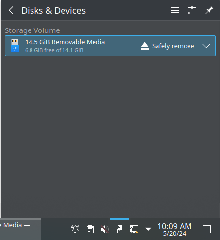
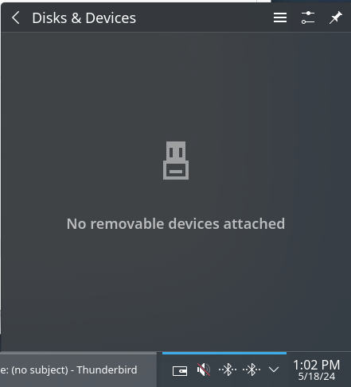

# Export data from the system

## Export to file

Requires that a `.hdr` file loaded into the `viewer` application.

Note that user choices for `Out File Type`, `Time Range`,
and `Channels` are remembered by the `viewer` application.

1. From the `File` menu, select `Export`
1. Choose `Out File Type` as `UFF58b` or `CSV`
1. Choose `Time Range` as either `All Time` or `From Start/End` (Selectors on main UI)
1. Choose a list of channel numbers.  eg.
    1. `1-1024` selects all available channels.
    1. `513` selects a single channel
    1. `1-25,43` selects a range and an individual channel
    1. `500-600,800-900` selects two ranges
1. Click `OK`
1. Choose a directory under `/export` and client `Save`
1. The export process may take some time depending on
    the number of channels, time range, and sample rate.

## Export via. Network

Default.

1. Copy the `.uff` file from under `/data` into `/export`.
1. From the Data Export console, launch a web browser and navigate to `https://192.168.80.1/`.
    - The contents of `/export` should be listed.
1. Download the new `.uff` file and save into ???
1. TBD...

##  Export via. USB

If requested.

1. Connect USB storage to one of the two Workstation computers in the CR rack.
1. A popup menu will appear.  Or click on the `Disks & Devices` icon.
1. Click on on `Open` or `Mount`.
1. Copy the appropriate `.uff` file.
    - This may take a long time.
1. Through the `Disks & Devices` menu, `Eject` or `Safely Remove` the USB storage device.
    - This may also take a long time.
    - __Do not disconnect__ USB storage until notified that it is safe to do so,
      or until the device has disappeared from the `Disks & Devices` menu.

