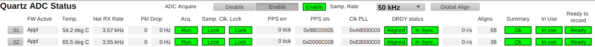

# Inspecting the Current State and Health of the system

Run after system power up, after any ADC chassis is power cycled,
or when it is otherwise desirable to ascertain system health.

1. From `Main`, open the `ADC Status` screen and check each row/Chassis.
1. If any/all cells show a purple border (PV disconnected)
    - Contact support before proceeding
1. Set `ADC Acquire` to `Disable`
1. If any `FW Active` show `None`
    1. Check chassis power and network connection
    1. Contact support before proceeding
1. If any `FW Active` show `Gold`.
    1. From `Main`, open the `FPGA Boot Control` page.
    1. Click `Boot App` for the appropriate chassis.  (or toggle Auto boot to `Auto`)
    1. Active FW will toggle back to `None` and then to `Appl` within 30 seconds
    1. If not, power cycle chassis and repeat once.
    1. Continue if `Appl` loads.  Notify support of occurrence.
1. If any `Samp. Clk. Lock` shows `Unlock`
    1. If Node 01, check Time Server Pulse Per Second (PPS) connection
    1. If another node, contact support
1. If any DRDY status show `Skew` for more than 5 seconds
    1. Contact support
1. If any DRDY status shows `Spread`.
    1. Click Global Align (at top)
    1. Wait 10 seconds
    1. If still out of sync. contact support
1. Set `ADC Acquire` to `Enable`
    1. All `Acq.` should show `Run`.
1. Observe that the `Pkt Drop` rate counters remain zero for a period of 30 seconds
    1. If packets are being dropped....
    1. For 250K sample rate, some chassis will need to be disabled.
    1. For other sample rates, contact support

