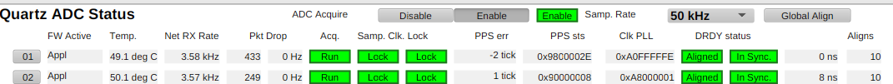
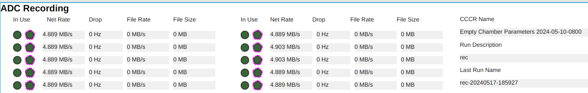
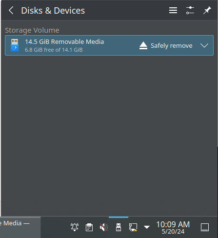
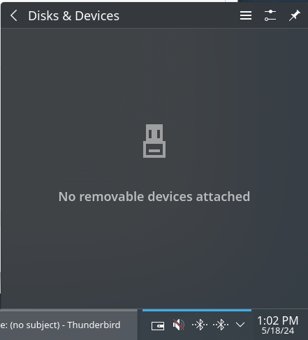
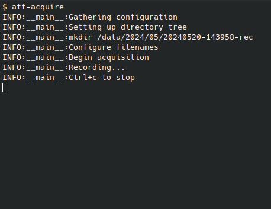
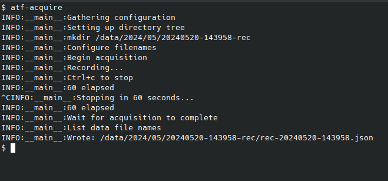
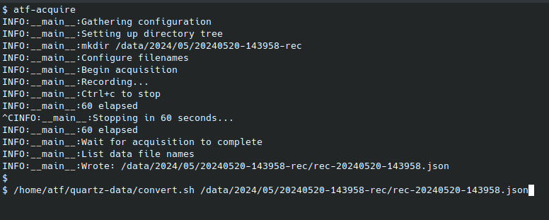
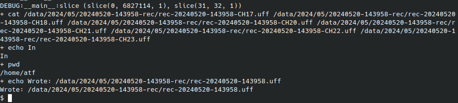

# Interim Data Collection Procedure

## 1. Prerequisites

Conditions necessary for a correct acquisition.

- Ensure CCCR Loaded
- Desired sample rate selected
- Check System status (From "Quartz ADC Status" screen)
    - Active firmware image: `Appl` (`FW Active` column)
    - Acquiring (`Acq.` column)
    - PPS Locked.  (`Samp. Clk. Lock` columns)
    - DRDY ok (`DRDY status` columns)
    - Network packet drop rates zero (`Pkt Drop` column)

## 2. Preparation

1. Set recording description.  (eg. "rec")  From `Acq. Recording` Expert screen.

## 3. Start Acquire

1. Disable Sampling if monitoring.  (from Main screen and others)
1. Launch `atf-acquire` on `DAQS` host.
    - `ssh 192.168.83.100`
    - Will run until acquisition completes.
    - Will print "60 seconds elapsed"
1. Note "Last recording name" on `Acq. Recording` Monitor or Expert screens.

## 4. Monitor Acquisition

While acquisition is in-progress, observe that:

- On `Acq. Recording` Monitor or Expert screens.
    - Recording is in progress for selected chassis
    - Packet drop rate counters remain zero
    - File size(s) increasing
- On `ADC Status` screen.
    - PPS Locked
    _ DRDY ok

## 5. Stop Acquire

1. Issue "Ctrl+c" to `atf-acquire`
    1. Will print "Stopping in 60 seconds..."
    1. Wait until process exists
    1. On success, last line printed will begin with `Wrote:` and a `.json` file name.  Note this name.
1. Re-enable Sampling to resume monitoring

## 6. Post Processing

1. Run `convert_raw /data/YYYY/MM/YYYYMMDD-HHMMSS-desc/desc-YYYYMMDD-HHMMSS.json`
1. On successful completion verify creation of: `/data/YYYY/MM/YYYYMMDD-HHMMSS-desc/desc-YYYYMMDD-HHMMSS.uff`.

Note `/data` on the `DAQS` host is visible as `/data` on both Workstations.

Note: Change directory to proper data folder to find the *.json file.

## 7.1 Export via. Network

Default.

1. Copy the `.uff` file from under `/data` into `/export`.
1. From the Data Export console, launch a web browser and navigate to `https://192.168.80.1/`.
    - The contents of `/export` should be listed.
1. Download the new `.uff` file and save into ???
1. TBD...

## 7.2 Export via. USB

If requested.

1. Connect USB storage to one of the two Workstation computers in the CR rack.
1. A popup menu will appear.  Or click on the `Disks & Devices` icon.
1. Click on on `Open` or `Mount`.
1. Copy the appropriate `.uff` file.
    - This may take a long time.
1. Through the `Disks & Devices` menu, `Eject` or `Safely Remove` the USB storage device.
    - This may also take a long time.
    - __Do not disconnect__ USB storage until notified that it is safe to do so,
      or until the device has disappeared from the `Disks & Devices` menu.

## Example Output

Beginning of an acquisition.

Completed acquisition.

Initiate conversion.

Conversion complete

