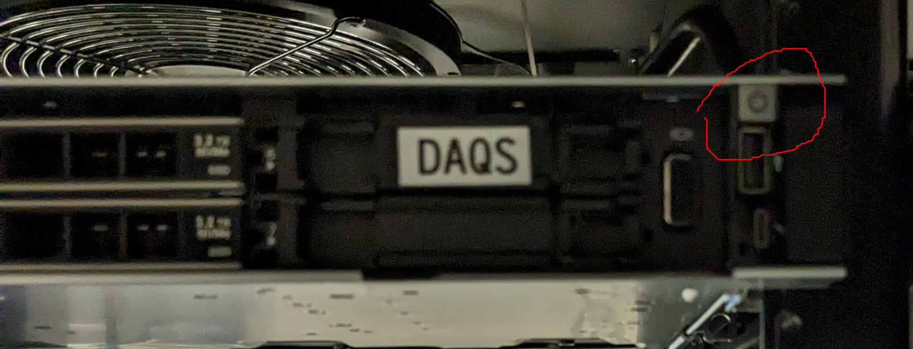
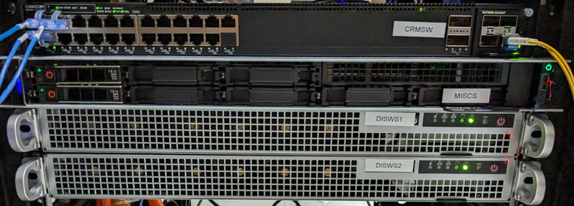
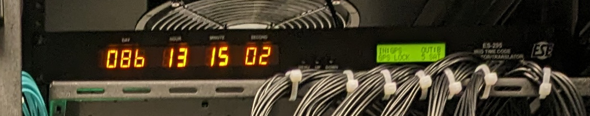
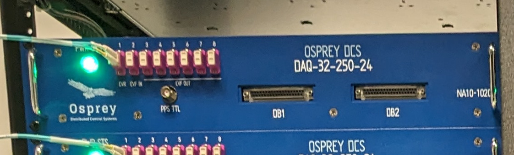
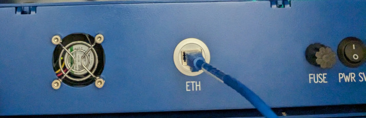

# System power up/down procedure

Covers global system power down and up,
as well as system recovery after individual chassis power cycle.

See Reference photos section below.

## System Power Down

Preparation for partial/total power outage.

1. Switch off power to all 32x Quartz Chassis in Instrument room
1. Press and quickly release power button on each computer
    1. DAQS server (Instrument room)
    1. MISC server (Control room)
    1. Workstation 1 (Control room)
    1. Workstation 2 (Control room)
1. Wait for computers to complete normal shutdown.
    - Indicated by fans stopping
    - If this takes more than 5 minutes, endeavor to contact support
    - If support is unavailable in the available time,
      press and hold power button until fans stop.
      (__Caution__, may result in data loss)

## System Power Up

Recovery from partial/total power outage.

1. Verify power to:
   1. Control room switch (visible from front)
   1. Instrument room switch (visible from rear)
   1. Instrument room Time Server
1. Wait for Time Server lock
   - GPS Status should show: `IN: GPS` and `GPS: LOCK`
   - Current UTC time incrementing
1. Press and quickly release power buttons on computers
    1. DAQS server
    1. MISC server
    1. Workstation 1
    1. Workstation 2
1. Switch on power to all Quartz Chassis
1. Verify Workstation boot (repeat for each)
    1. Connect KVM console to Workstation 1 or 2
    1. Should see Desktop (autologin to default user)
    1. Use the icon on Desktop to launch the `Phoebus` application.
    1. Select the `Main` tab.
1. Proceed to Recovery and Troubleshooting

## Recovery and Troubleshooting

Run after system power up, after any ADC chassis is power cycled,
or when it is otherwise desirable to ascertain system health.

1. From `Main`, open the `ADC Status` screen and check each row/Chassis.
1. If any/all cells show a purple border (PV disconnected)
    - Contact support before proceeding
1. Set `ADC Acquire` to `Disable`
1. If any `FW Active` show `None`
    1. Check chassis power and network connection
    1. Contact support before proceeding
1. If any `FW Active` show `Gold`.
    1. From `Main`, open the `FPGA Boot Control` page.
    1. Click `Boot App` for the appropriate chassis.  (or toggle Auto boot to `Auto`)
    1. Active FW will toggle back to `None` and then to `Appl` within 30 seconds
    1. If not, power cycle chassis and repeat once.
    1. Continue if `Appl` loads.  Notify support of occurrence.
1. If any `Samp. Clk. Lock` shows `Unlock`
    1. If Node 01, check Time Server Pulse Per Second (PPS) connection
    1. If another node, contact support
1. If any DRDY status show `Misalign` for more than 5 seconds
    1. Contact support
1. If any DRDY status shows `Out of Sync`.
    1. Click Global Align
    1. Wait 10 seconds
    1. If still out of sync. contact support
1. Set `ADC Acquire` to `Enable`
    1. All `Acq.` should show `Run`.
1. Observe that the `Pkt Drop` rate counters remain zero for a period of 30 seconds
    1. If packets are being dropped....
    1. For 250K sample rate, some chassis will need to be disabled.
    1. For other sample rates, contact support

## References

Location of DAQS server power button location.

Location of power buttons for MISC and Workstations.

Time Server front panel.

Quartz chassis Front and Rear panels.

