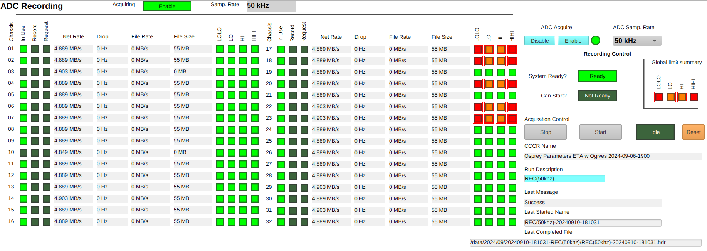

# Configuration and Acquisition

## Prerequisites

Successful completion of [Inspecting the Current State and Health](healthcheck.md) of the system.

It is necessary to repeat Inspecting the Current State and Health after
any chassis is power cycled or otherwise reset.

It is recommended to repeat [Inspecting the Current State and Health](healthcheck.md) of the system
at the start of each day on which records will be collected.

## Preparation

1. Ensure that the desired `ADC Sample Rate` is selected.
   Found on `Main`, `ADC Status`, and other OPIs.
    1. After changing the sampling rate, repeat [Inspecting the Current State and Health](healthcheck.md) of the system.
1. Set the desired `Run Description` string.

## Start Acquisition

1. Open the `Acq. Control` OPI (`Main` -> `Acq. Recording` -> `Control`).
1. Ensure `System Ready?` shows `Ready`.
    1. If not, repeat [Inspecting the Current State and Health](healthcheck.md) of the system and then re-load CCCR.
    1. If not successful, contact support.
1. Disable `ADC Acquire`.
    1. ADC sampling must be disabled for a synchronized re-start.
1. Ensure `Can Start?` shows `Ready`.
1. Click `Start`.
1. Ensure status shows `Run` and Last Message `Acquire`.
    1. If not, contact support.
1. `ADC Acquire` will switch back to `Enable` automatically.
1. `Last Started Name` will update with the current run name.

Note that `Can Start?` will show `Not ready` while an acquisition is running.

## Monitor Acquisition

While acquisition is in-progress, observe that:

- On `Acq. Recording` Monitor or Expert screens.
    - Ensure `System Ready?` continues to show `Ready`.
    - Recording is in progress for selected chassis.
    - Packet drop rate counters remain zero.
    - File size(s) increasing.
- On `ADC Status` screen.
    - `Summary` for all `In Use` shows `Ok`.

## End Acquisition

1. On the `Acq. Control` OPI.
1. Click `Stop`.
1. `ADC Acquire` will switch back to `Disable` automatically.
1. Last Message will progress through:
    1. `Stopping...` (waiting for all samples to reach disk storage).
    1. `Post-process` while `.hdr` file is prepared for `viewer` application.
    1. `Success` Successful completion.
1. If Last Message shows `Failure`, contact support.
1. On `Success` the `Last Completed File` will update with the full path.
   of the newly created `.hdr`.
    1. Hint: May select and copy+paste into `viewer` Open dialog.

